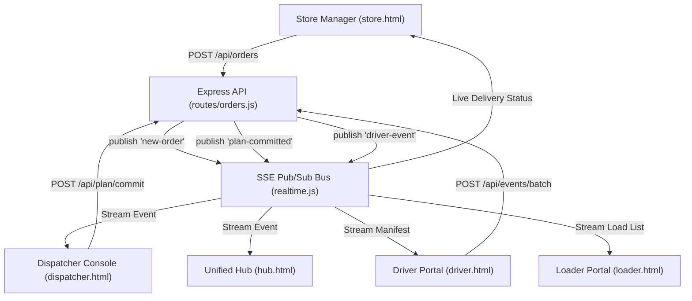

# 📋 Comparative System Audit & Evolution Report
**System:** LegacyAurora WaypointDispatch  
**Baseline Document:** `docs/system_report.md` (Initial Gap Analysis & Feature Wishlist)  
**Target Document:** `docs/system_analysis_report.md` (Deep Production Audit & Architectural Roadmap)  
**Date:** 2026-10-02

---

## Executive Summary

This report delivers a comparative audit between the initial assessment ([system_report.md](file:///c:/Users/LENOVO/OneDrive/Desktop/Delivery%20System/LegacyAurora_WaypointDispatch/docs/system_report.md)) and the comprehensive technical audit ([system_analysis_report.md](file:///c:/Users/LENOVO/OneDrive/Desktop/Delivery%20System/LegacyAurora_WaypointDispatch/docs/system_analysis_report.md)). 

It details:
1. **What has changed** in system architecture, visibility, and depth of analysis.
2. **What has actually been completed and implemented** in code since the baseline was written.
3. **What enhancements are designed and scheduled** across the 7-phase production-readiness roadmap.

---

## 1. Comparative Analysis: What Has Changed

```
┌──────────────────────────────────────────────┐       ┌──────────────────────────────────────────────┐
│        Baseline: system_report.md            │       │   Target: system_analysis_report.md          │
├──────────────────────────────────────────────┤       ├──────────────────────────────────────────────┤
│ • Surface-level hackathon gap analysis       │       │ • In-depth production codebase audit         │
│ • Assumed NO real-time engine existed        │  ──►  │ • Audited in-process SSE bus & channel model │
│ • Assumed store order placement missing      │       │ • Evaluated POST /api/orders & validation    │
│ • Ignored test suite & reliability risks     │       │ • Full 38-test audit across 8 test suites    │
│ • High-level 10-point wishlist               │       │ • 7-Phase production roadmap with code diffs │
└──────────────────────────────────────────────┘       └──────────────────────────────────────────────┘
```

### Key Differences Breakdown

| Area | Baseline Report (`system_report.md`) | Comprehensive Audit (`system_analysis_report.md`) |
| :--- | :--- | :--- |
| **Scope & Coverage** | High-level audit of 4 primary portals (`index`, `dispatcher`, `driver`, `loader`, `store`). | Comprehensive audit of 5 portals + [hub.html](file:///c:/Users/LENOVO/OneDrive/Desktop/Delivery%20System/LegacyAurora_WaypointDispatch/client/hub.html), [waypoint.js](file:///c:/Users/LENOVO/OneDrive/Desktop/Delivery%20System/LegacyAurora_WaypointDispatch/client/waypoint.js) SDK, [outbox.js](file:///c:/Users/LENOVO/OneDrive/Desktop/Delivery%20System/LegacyAurora_WaypointDispatch/client/outbox.js), and backend modules. |
| **Real-Time Architecture** | Documented real-time as `❌ 6.1 NO Real-Time Communication` (completely missing). | Identifies and audits the working **Server-Sent Events (SSE) Pub/Sub Engine** ([realtime.js](file:///c:/Users/LENOVO/OneDrive/Desktop/Delivery%20System/LegacyAurora_WaypointDispatch/server/src/realtime.js)) with channel scoping (`dispatcher`, `driver:{id}`, `loader:{id}`, `store:{id}`). |
| **Security Audit** | Focused on bypassable client-side hardcoded credentials. | Audited all **23 API endpoints**, discovering that **20 of 23 endpoints lack authentication/authorization** (`requireAuth`/`requireRole`). |
| **Testing Evaluation** | No test analysis provided. | Thorough evaluation of **8 test suites (1,895 lines, 38 tests)** with Grade B rating, highlighting mock drift risks and absence of real PostgreSQL tests. |
| **Actionable Roadmap** | 10 general recommendations. | **7-Phase Engineering Blueprint** with concrete code diffs, Prisma schema additions, architecture diagrams, and a Priority Matrix. |

---

## 2. What Has Been Completed & Implemented

The following features, previously listed as missing in `system_report.md`, have been built and integrated into the repository:



### Implemented Feature Inventory

1. **Store Order Placement Flow (`POST /api/orders`)**
   - Implemented in `routes/orders.js` with role check (`manager`).
   - Inserts order into PostgreSQL in `queued` status and broadcasts `new-order` event to the `dispatcher` channel.
2. **Server-Sent Events Real-Time Pub/Sub Engine ([realtime.js](file:///c:/Users/LENOVO/OneDrive/Desktop/Delivery%20System/LegacyAurora_WaypointDispatch/server/src/realtime.js))**
   - Added `GET /api/stream` endpoint with client channel subscription scoping.
   - Built event dispatching for: `new-order`, `plan-committed`, `driver-event`, `shortage-flagged`, `receipt-confirmed`, and `trip-status`.
3. **Unified System Command Hub ([hub.html](file:///c:/Users/LENOVO/OneDrive/Desktop/Delivery%20System/LegacyAurora_WaypointDispatch/client/hub.html))**
   - Single-pane entry point with real-time KPI metrics (`queued`, `allocated`, `deferred`, `delivered`).
   - Role-based portal navigation cards with access restriction indicators and live toast notification listener.
4. **Client SDK & Offline Outbox Sync ([waypoint.js](file:///c:/Users/LENOVO/OneDrive/Desktop/Delivery%20System/LegacyAurora_WaypointDispatch/client/waypoint.js) & [outbox.js](file:///c:/Users/LENOVO/OneDrive/Desktop/Delivery%20System/LegacyAurora_WaypointDispatch/client/outbox.js))**
   - `WaypointClient` handles JWT session verification (`/api/auth/me`), SSE connection management, and automatic reconnection.
   - `WaypointOutbox` provides offline-first localStorage queueing and idempotent batch event replay via `/api/events/batch`.
5. **Trip Lifecycle Progression Engine**
   - Added automatic vehicle and trip status transitions (`planned` $\to$ `loading` $\to$ `departed` $\to$ `completed`) tied to driver POD and telemetry events.
6. **Automated Test Coverage (38 Tests)**
   - Comprehensive test suites validating allocation engine rules, travel matrix formulas, RBAC gates, offline outbox idempotency, and full multi-party E2E lifecycles.

---

## 3. What Enhancements Have Been Added to the Roadmap

The updated audit in [system_analysis_report.md](file:///c:/Users/LENOVO/OneDrive/Desktop/Delivery%20System/LegacyAurora_WaypointDispatch/docs/system_analysis_report.md) replaces generic suggestions with a 7-phase production roadmap:

### 🛡️ Phase 1: Security & Stability Foundation
- **Lock Down All 20 Exposed Endpoints:** Apply `requireAuth` and `requireRole` across `/api/plan/allocate`, `/api/plan/commit`, `/api/events/batch`, `/api/flags`, and `/api/receipt`.
- **Singleton PrismaClient:** Replace 4 distinct `new PrismaClient()` instances with a single connection-pooled instance in `server/src/prisma.js`.
- **Zod Input Validation:** Enforce strict schemas for order payloads, coordinates, and batch events.
- **Security Headers:** Enforce CSP, HSTS, `X-Frame-Options: DENY`, and `X-Content-Type-Options: nosniff`.

### 🧭 Phase 2: Unified Command Center & Cross-Portal Navigation
- Upgrade `hub.html` with a live filterable activity stream, unread notification center, and system health telemetry.
- Inject a shared top navigation bar across all operator portals.

### ⚡ Phase 3: Scalable Production Real-Time Architecture
- Migrate from in-memory, single-process SSE to **Supabase Realtime (CDC)** or **Socket.io + Redis Pub/Sub** to enable horizontal scaling and serverless hosting compatibility.

### 🎨 Phase 4: Frontend Modernization
- Break down monolithic files (such as the 4,764-line `dispatcher.html`) into modular components using **Vite** and a shared design system (`design-system.css`).

### ⚙️ Phase 5: API Hardening & Scalability
- **Database Indexing:** Add composite indexes on `Order(outletId, status)`, `DeliveryEvent(vehicleId, type)`, and `Trip(status)`.
- **Cursor Pagination:** Paginate `/api/orders`, `/api/deferrals`, and `/api/flags`.
- **Cloud Object Storage:** Transition shortage photos from container filesystem storage to Supabase Storage / AWS S3.
- **Rate Limiting:** Protect auth and telemetry upload endpoints against DDoS.

### 🧪 Phase 6: Production-Grade Testing
- Integrate `embedded-postgres` so integration tests run against genuine PostgreSQL queries instead of in-memory route mocks.
- Implement Playwright E2E browser tests and `k6` load test suites for concurrent event syncing.

### 🚀 Phase 7: Infrastructure & Observability
- Deploy persistent container hosting (Railway/Render/AWS), configure structured logging (Pino), and integrate Sentry error tracking.

---

## 4. Priority Matrix

```mermaid
quadrantChart
    title Enhancement Priority vs Effort
    x-axis Low Effort --> High Effort
    y-axis Low Impact --> High Impact
    quadrant-1 Do First (Sprint 1)
    quadrant-2 Plan Carefully (Sprint 2)
    quadrant-3 Quick Wins
    quadrant-4 Deprioritize

    "Auth on all endpoints": [0.2, 0.95]
    "Singleton PrismaClient": [0.15, 0.7]
    "Input validation (Zod)": [0.3, 0.8]
    "Security headers": [0.1, 0.6]
    "Rate limiting": [0.25, 0.55]
    "Pagination": [0.35, 0.65]
    "WebSocket/Supabase RT": [0.7, 0.9]
    "Real DB tests": [0.5, 0.85]
    "Frontend Vite Migration": [0.85, 0.75]
    "Playwright E2E tests": [0.6, 0.7]
    "Photo cloud storage": [0.45, 0.5]
    "Multi-tenant": [0.9, 0.6]
```
