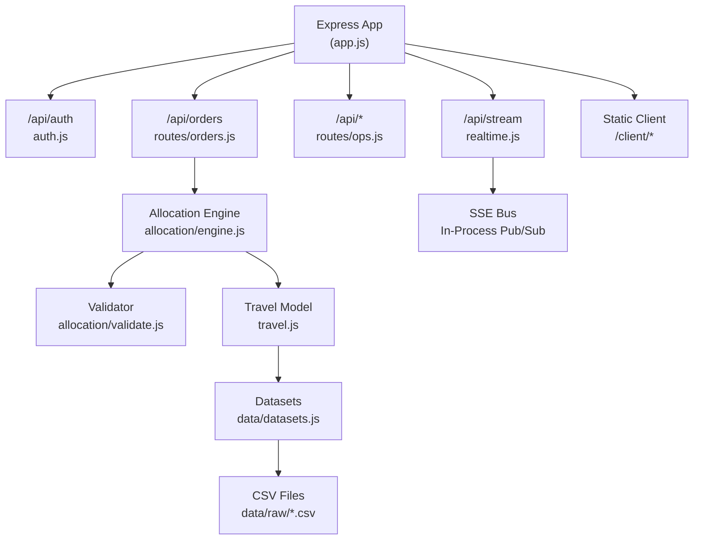
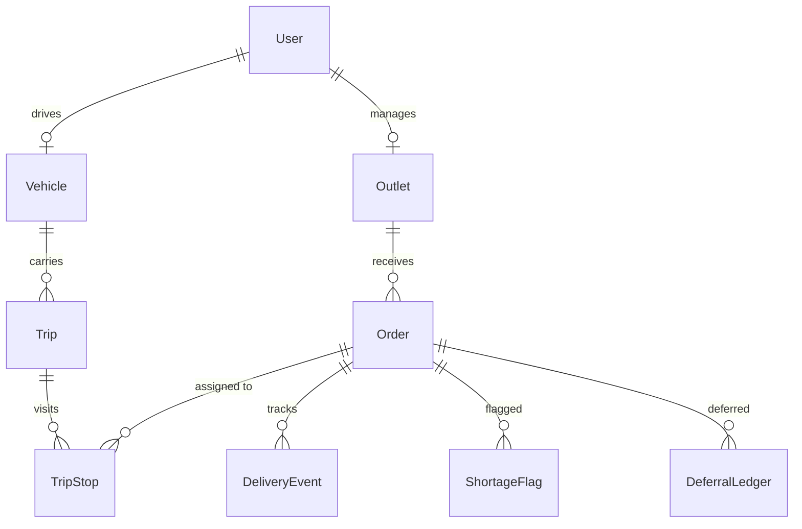
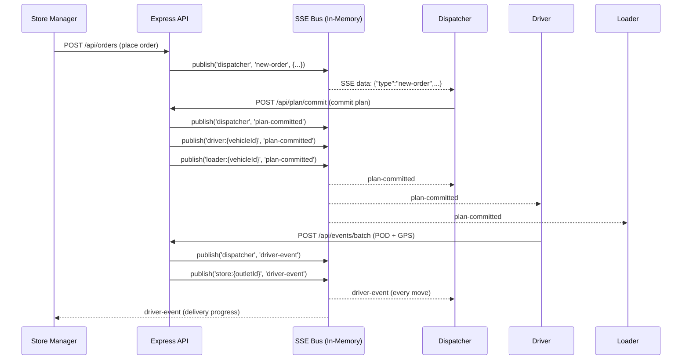
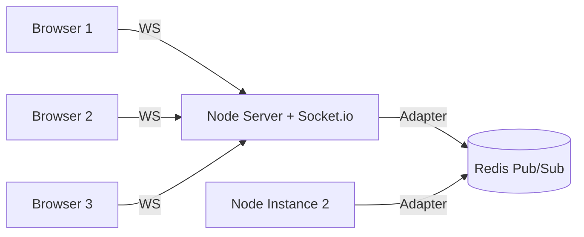
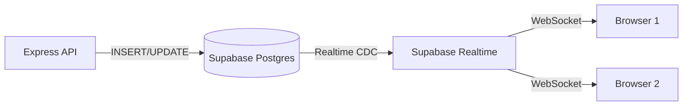
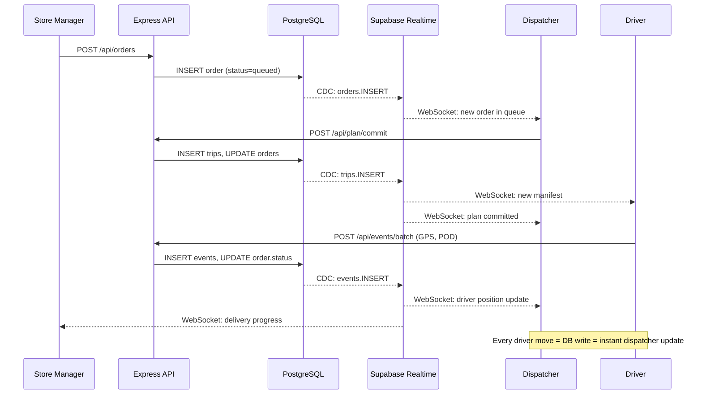
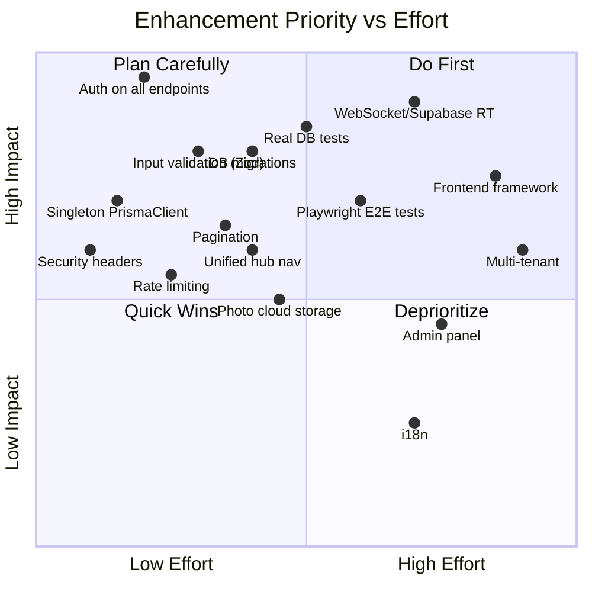

# 🛰️ LegacyAurora WaypointDispatch — System Analysis & Production-Readiness Report

> **Generated:** 2026-10-01 | **Scope:** Full codebase audit — architecture, real-time flows, test coverage, and unified system enhancement roadmap

---

## Table of Contents

1. [Current System Overview](#1-current-system-overview)
2. [Architecture Analysis](#2-architecture-analysis)
3. [Real-Time Data Flow Analysis](#3-real-time-data-flow-analysis)
4. [Test Suite Assessment](#4-test-suite-assessment)
5. [Gap Analysis: What's Missing for Production](#5-gap-analysis-whats-missing-for-production)
6. [Enhancement Roadmap](#6-enhancement-roadmap)

---

## 1. Current System Overview

### What the System Does

WaypointDispatch is a **last-mile delivery dispatch system** built for the Rootcode Tech-Triathlon hackathon. It orchestrates the flow of goods from depot to store across four operator roles:

| Role | Portal | File | Size | Purpose |
|------|--------|------|------|---------|
| **Dispatcher** | [dispatcher.html](file:///c:/Users/LENOVO/OneDrive/Desktop/Delivery%20System/LegacyAurora_WaypointDispatch/client/dispatcher.html) | 4,764 lines | 236 KB | Order queue, allocation engine, fleet board, analytics |
| **Driver** | [driver.html](file:///c:/Users/LENOVO/OneDrive/Desktop/Delivery%20System/LegacyAurora_WaypointDispatch/client/driver.html) | 2,331 lines | 106 KB | Route manifest, POD capture, offline outbox |
| **Loader** | [loader.html](file:///c:/Users/LENOVO/OneDrive/Desktop/Delivery%20System/LegacyAurora_WaypointDispatch/client/loader.html) | 2,607 lines | 98 KB | Load plans, shortage flagging with photos |
| **Store Manager** | [store.html](file:///c:/Users/LENOVO/OneDrive/Desktop/Delivery%20System/LegacyAurora_WaypointDispatch/client/store.html) | 1,807 lines | 69 KB | Order placement, delivery timeline, goods receipt |
| **Hub** | [hub.html](file:///c:/Users/LENOVO/OneDrive/Desktop/Delivery%20System/LegacyAurora_WaypointDispatch/client/hub.html) | 258 lines | 17 KB | Unified system home with KPI dashboard |

### Technology Stack

| Layer | Technology | Notes |
|-------|-----------|-------|
| **Frontend** | Vanilla HTML/CSS/JS (5 monolithic files) | No framework, no build step, no component system |
| **Shared Client SDK** | [waypoint.js](file:///c:/Users/LENOVO/OneDrive/Desktop/Delivery%20System/LegacyAurora_WaypointDispatch/client/waypoint.js) + [outbox.js](file:///c:/Users/LENOVO/OneDrive/Desktop/Delivery%20System/LegacyAurora_WaypointDispatch/client/outbox.js) | Auth, SSE, GPS, offline sync |
| **Service Worker** | [sw.js](file:///c:/Users/LENOVO/OneDrive/Desktop/Delivery%20System/LegacyAurora_WaypointDispatch/client/sw.js) | Cache-first shell, network-first API |
| **Backend** | Express 5 (Node 20) | CommonJS modules, single entry point |
| **ORM** | Prisma 6.5 | PostgreSQL 16, schema-driven |
| **Auth** | bcrypt + JWT (httpOnly cookie) | 12h expiry, role middleware |
| **Real-time** | SSE (Server-Sent Events) | In-process pub/sub, channel scoping |
| **Database** | PostgreSQL 16 | Docker or Supabase (production) |
| **Deployment** | Docker Compose (dev) + Vercel + Supabase (prod) | Single container, one origin |
| **CI** | GitHub Actions | Unit tests → Docker compose smoke tests |

---

## 2. Architecture Analysis

### Backend Structure



### Database Schema (13 Models)



### API Endpoints Inventory

| Method | Endpoint | Auth | Purpose |
|--------|----------|------|---------|
| `POST` | `/api/auth/login` | ❌ | Login → JWT cookie |
| `POST` | `/api/auth/logout` | ❌ | Clear cookie |
| `GET` | `/api/auth/me` | ✅ | Session + bindings |
| `GET` | `/api/orders` | ❌ | Queue + capacity verdict |
| `POST` | `/api/orders` | ✅ manager | Place new order |
| `POST` | `/api/orders/:id/defer` | ❌ | Manual deferral |
| `POST` | `/api/plan/allocate` | ❌ | Dry-run allocation |
| `POST` | `/api/plan/commit` | ❌ | Commit plan |
| `GET` | `/api/trips` | ❌ | All committed trips |
| `GET` | `/api/trips/for-driver` | ❌ | Driver's manifest |
| `GET` | `/api/trips/:vehicleCode` | ❌ | Vehicle manifest |
| `POST` | `/api/events/batch` | ❌ | Idempotent event sync |
| `POST` | `/api/flags` | ❌ | Shortage report |
| `GET` | `/api/flags` | ❌ | List flags |
| `GET` | `/api/flags/geo` | ❌ | GPS positions |
| `GET` | `/api/outlet/:id/timeline` | ❌ | Store timeline |
| `POST` | `/api/receipt` | ❌ | Goods receipt |
| `POST` | `/api/telemetry/outage` | ❌ | Toggle outage |
| `GET` | `/api/telemetry/fleet` | ❌ | Fleet board |
| `GET` | `/api/analytics/summary` | ❌ | KPI aggregation |
| `GET` | `/api/deferrals` | ❌ | Deferral ledger |
| `GET` | `/api/stream` | ✅ | SSE event stream |
| `GET` | `/api/health` | ❌ | Liveness probe |

> [!CAUTION]
> **Critical finding:** Only 3 out of 23 endpoints enforce authentication (`/api/auth/me`, `POST /api/orders`, `/api/stream`). All other endpoints are completely unprotected — any unauthenticated request can allocate plans, commit trips, sync events, or view all data.

---

## 3. Real-Time Data Flow Analysis

### Current SSE Architecture

The system uses an **in-process pub/sub bus** via [realtime.js](file:///c:/Users/LENOVO/OneDrive/Desktop/Delivery%20System/LegacyAurora_WaypointDispatch/server/src/realtime.js) with Server-Sent Events:



### Channel Scoping

| Channel | Subscribers | Events Received |
|---------|------------|-----------------|
| `dispatcher` | Dispatcher console, Hub | All: new-order, plan-committed, driver-event, shortage-flagged, receipt-confirmed, trip-status, vehicle-status |
| `driver:{vehicleId}` | Specific driver | plan-committed for their vehicle |
| `loader:{vehicleId}` | Loader for that vehicle | plan-committed for their vehicle |
| `loader` (role-level) | All loaders | plan-committed (bulk) |
| `store:{outletId}` | Specific store manager | driver-event, shortage-flagged, receipt-confirmed for their outlet |

### What's Working in Real-Time ✅

| Flow | Status | How |
|------|--------|-----|
| Store Manager → Dispatcher queue | ✅ Works | `publish('dispatcher', 'new-order')` on POST /api/orders |
| Plan commit → Driver + Loader | ✅ Works | `publish('driver:{vehicleId}', 'plan-committed')` on commit |
| Driver POD → Dispatcher screen | ✅ Works | `publish('dispatcher', 'driver-event')` on events/batch |
| Driver POD → Store Manager | ✅ Works | `publish('store:{outletId}', 'driver-event')` on events/batch |
| Shortage flag → Dispatcher | ✅ Works | `publish('dispatcher', 'shortage-flagged')` on POST /api/flags |
| Receipt → Dispatcher | ✅ Works | `publish('dispatcher', 'receipt-confirmed')` on POST /api/receipt |
| Vehicle status changes | ✅ Works | `advanceTripLifecycle()` → `publish('dispatcher', 'trip-status')` |

### What's NOT Working / Missing ❌

| Flow | Issue |
|------|-------|
| **SSE on Vercel (serverless)** | SSE connections are killed after ~10s by serverless timeout. Production has no real-time. |
| **Multi-instance** | In-memory pub/sub dies on restart; doesn't scale past 1 process/container |
| **Driver GPS live tracking** | GPS is captured per-event but there's no continuous tracking stream. Dispatcher sees last-known only via `/api/flags/geo` polling |
| **Loader plan updates** | Loader channel receives `plan-committed` but has no granular item/stop-level updates |
| **Hub page** | Shows toast notifications but relies on re-fetching all KPIs on every event (full reload pattern) |

---

## 4. Test Suite Assessment

### Test File Inventory

| Test File | Lines | Tests | Type | Coverage Area |
|-----------|-------|-------|------|---------------|
| [allocation.test.js](file:///c:/Users/LENOVO/OneDrive/Desktop/Delivery%20System/LegacyAurora_WaypointDispatch/tests/allocation.test.js) | 154 | 10 | Unit | Validator rules, engine determinism, priority policy |
| [auth.test.js](file:///c:/Users/LENOVO/OneDrive/Desktop/Delivery%20System/LegacyAurora_WaypointDispatch/tests/auth.test.js) | 128 | 5 | Unit | JWT validation, RBAC middleware |
| [travel.test.js](file:///c:/Users/LENOVO/OneDrive/Desktop/Delivery%20System/LegacyAurora_WaypointDispatch/tests/travel.test.js) | 106 | 7 | Unit | Travel-time model, dataset loading |
| [outbox.test.js](file:///c:/Users/LENOVO/OneDrive/Desktop/Delivery%20System/LegacyAurora_WaypointDispatch/tests/outbox.test.js) | 172 | 4 | Unit | Offline outbox sync engine |
| [orders_api.test.js](file:///c:/Users/LENOVO/OneDrive/Desktop/Delivery%20System/LegacyAurora_WaypointDispatch/tests/orders_api.test.js) | 248 | 2 | Integration | Orders queue, deferrals |
| [ops_api.test.js](file:///c:/Users/LENOVO/OneDrive/Desktop/Delivery%20System/LegacyAurora_WaypointDispatch/tests/ops_api.test.js) | 354 | 4 | Integration | Batch sync, flags, receipts, telemetry |
| [realtime_api.test.js](file:///c:/Users/LENOVO/OneDrive/Desktop/Delivery%20System/LegacyAurora_WaypointDispatch/tests/realtime_api.test.js) | 417 | 5 | Integration | SSE wire format, channel security, order broadcast |
| [e2e_workflow.test.js](file:///c:/Users/LENOVO/OneDrive/Desktop/Delivery%20System/LegacyAurora_WaypointDispatch/tests/e2e_workflow.test.js) | 316 | 1 | E2E | Full multi-role lifecycle |
| **Total** | **1,895** | **38** | — | — |

### Test Quality Rating

```
Overall Grade: B (Good for Hackathon, Incomplete for Production)
```

#### Strengths ✅

| Aspect | Rating | Details |
|--------|--------|---------|
| **Allocation Engine** | ⭐⭐⭐⭐⭐ | Comprehensive: all 9 hard constraints tested, determinism verified, deferral reason codes validated |
| **Idempotency** | ⭐⭐⭐⭐⭐ | Duplicate event replay tested both in unit (outbox) and integration (batch API) |
| **E2E Lifecycle** | ⭐⭐⭐⭐ | Full 6-step walkthrough: order → allocate → commit → load → deliver → receipt matching |
| **Auth/RBAC** | ⭐⭐⭐⭐ | JWT lifecycle, role gates, edge cases (missing cookie, expired token) |
| **SSE Security** | ⭐⭐⭐⭐ | Channel intersection tested; driver can't watch another vehicle |
| **Travel Model** | ⭐⭐⭐⭐ | Monsoon, traffic, cross-district, fallbacks all tested |
| **Offline Resilience** | ⭐⭐⭐⭐ | Conflict retention, duplicate clearing, network toggle tested |
| **CI Pipeline** | ⭐⭐⭐ | 2-stage: unit → docker compose smoke test with curl-based verification |

#### Weaknesses ❌

| Gap | Impact | Details |
|-----|--------|---------|
| **No tests run against real DB** | 🔴 High | All integration tests use in-memory mocks that re-implement route logic. Prisma queries are never tested against actual PostgreSQL. |
| **Mock drift risk** | 🔴 High | `ops_api.test.js` and `orders_api.test.js` copy-paste the route handler logic into mock harnesses. If the real route changes, tests pass but the app breaks. |
| **No auth on 20/23 endpoints** | 🔴 Critical | Tests don't verify that unauthorized users are blocked from plan/commit, events/batch, flags, receipts, telemetry, etc. |
| **No frontend tests** | 🟡 Medium | 11,000+ lines of client JS with zero tests. No Playwright/Puppeteer/Cypress browser tests. |
| **No load/stress testing** | 🟡 Medium | SSE fan-out performance, concurrent batch uploads, DB connection pooling untested. |
| **No error boundary tests** | 🟡 Medium | DB outage, Prisma connection failure, malformed JWT, oversized payloads — some tested, most not. |
| **Seed verification is one-shot** | 🟢 Low | CI smoke tests run against seeded data only; no parameterized/randomized testing. |

---

## 5. Gap Analysis: What's Missing for Production

### 🔴 Critical (Must Fix)

| # | Gap | Current State | Production Requirement |
|---|-----|---------------|----------------------|
| 1 | **Authentication on all endpoints** | Only 3/23 endpoints protected | Every mutating and data endpoint must require `requireAuth` + `requireRole` |
| 2 | **Real-time in serverless** | SSE dies on Vercel (10s timeout) | Need WebSocket/Socket.io via a persistent server, or external pub/sub (e.g., Ably, Pusher, Supabase Realtime) |
| 3 | **No input validation/sanitization** | Minimal field presence checks | Use a validation library (Zod/Joi); sanitize all string inputs; rate-limit batch endpoints |
| 4 | **Single PrismaClient per module** | Each module creates `new PrismaClient()` (4 instances) | Singleton pattern; connection pooling; health-check on pool |
| 5 | **No database migrations** | Uses `prisma db push` (schema sync) | Must use `prisma migrate deploy` with versioned migration files |
| 6 | **Hardcoded demo day** | `DEMO_DAY = '2026-06-25'` throughout | Dynamic date handling; multi-day operations |
| 7 | **No HTTPS enforcement** | Cookies set `secure: NODE_ENV === 'production'` | HSTS headers, CORS policy, CSP headers |

### 🟡 Important (Should Fix)

| # | Gap | Details |
|---|-----|---------|
| 8 | **Monolithic HTML files** | 4,764-line dispatcher.html with inline CSS+JS. Unmaintainable. Needs component framework. |
| 9 | **No API versioning** | All routes at `/api/*`. Breaking changes break all clients instantly. |
| 10 | **No logging/observability** | Only `console.error`. No structured logs, no request tracing, no metrics. |
| 11 | **No error recovery for SSE** | Client backoff → polling fallback exists, but server never recovers dropped connections. |
| 12 | **Sequential DB writes on commit** | Plan commit does N sequential `prisma.trip.create` calls. Should batch or use transactions. |
| 13 | **File upload for photos** | Shortage flag photos saved to local filesystem (`uploads/`). Won't survive container restart. |
| 14 | **No pagination** | `/api/orders`, `/api/deferrals`, `/api/flags` return ALL records. Will collapse at scale. |
| 15 | **No multi-tenant / multi-depot** | Hardcoded to Peliyagoda depot. Single-tenant architecture. |

### 🟢 Nice to Have

| # | Gap | Details |
|---|-----|---------|
| 16 | No notification system (push/email/SMS) |
| 17 | No audit trail / activity log |
| 18 | No admin panel for user management |
| 19 | No mobile-responsive optimization tests |
| 20 | No i18n / localization support |

---

## 6. Enhancement Roadmap

### Phase 1: Security & Stability Foundation

> [!IMPORTANT]
> This phase blocks everything. The system is currently an open API.

#### 1.1 — Lock Down All Endpoints

```diff
 // routes/orders.js
-router.post('/plan/allocate', async (req, res) => {
+router.post('/plan/allocate', requireAuth, requireRole('dispatcher'), async (req, res) => {

-router.post('/plan/commit', async (req, res) => {
+router.post('/plan/commit', requireAuth, requireRole('dispatcher'), async (req, res) => {

 // routes/ops.js
-router.post('/events/batch', async (req, res) => {
+router.post('/events/batch', requireAuth, requireRole('driver'), async (req, res) => {

-router.post('/flags', async (req, res) => {
+router.post('/flags', requireAuth, requireRole('loader'), async (req, res) => {

-router.post('/receipt', async (req, res) => {
+router.post('/receipt', requireAuth, requireRole('manager'), async (req, res) => {
```

#### 1.2 — Singleton PrismaClient

```javascript
// server/src/prisma.js (NEW)
const { PrismaClient } = require('@prisma/client');
const prisma = new PrismaClient({
  log: process.env.NODE_ENV === 'development' ? ['query', 'warn', 'error'] : ['error'],
});
module.exports = prisma;
```

#### 1.3 — Input Validation with Zod

```javascript
const { z } = require('zod');

const OrderSchema = z.object({
  tempRequirement: z.enum(['chilled', 'ambient']),
  units: z.number().int().positive().max(10000),
  weightKg: z.number().positive().optional(),
  volumeM3: z.number().positive().optional(),
  orderDate: z.string().regex(/^\d{4}-\d{2}-\d{2}$/).optional(),
  windowOpen: z.string().regex(/^\d{2}:\d{2}$/).optional(),
  windowClose: z.string().regex(/^\d{2}:\d{2}$/).optional(),
});
```

#### 1.4 — Security Headers Middleware

```javascript
app.use((req, res, next) => {
  res.setHeader('X-Content-Type-Options', 'nosniff');
  res.setHeader('X-Frame-Options', 'DENY');
  res.setHeader('Strict-Transport-Security', 'max-age=31536000; includeSubDomains');
  res.setHeader('Content-Security-Policy', "default-src 'self'; ...");
  next();
});
```

---

### Phase 2: Unified System Home & Navigation

> The hub.html exists but is a read-only dashboard. Make it the **system command center**.

#### 2.1 — Unified Hub Enhancement

The current [hub.html](file:///c:/Users/LENOVO/OneDrive/Desktop/Delivery%20System/LegacyAurora_WaypointDispatch/client/hub.html) already has:
- ✅ Role-based portal cards (locked/unlocked)
- ✅ Live KPI strip (queued, allocated, deferred, delivered)
- ✅ Health indicators (API, SSE stream)
- ✅ Real-time toast notifications
- ✅ Clock + date display

**Enhancements needed:**

| Feature | Description |
|---------|-------------|
| **Live Activity Feed** | Scrolling timeline of all system events (not just toasts) with filters by role/type |
| **Cross-Portal Navigation** | Breadcrumb header on every portal that links back to hub; role-aware sidebar |
| **Unified Notification Center** | Bell icon showing unread events across all channels |
| **System Status Dashboard** | DB connection pool, SSE client count, API response times, error rates |
| **Role Switcher (Admin)** | Dispatcher can impersonate any role for troubleshooting |

#### 2.2 — Shared Navigation Component

Every portal page should embed a consistent header:

```html
<!-- Inject via waypoint.js on DOMContentLoaded -->
<nav class="wp-topbar">
  <a href="hub.html" class="wp-home">🛰️ Waypoint</a>
  <div class="wp-breadcrumb">Hub → Dispatcher Console</div>
  <div class="wp-status-dot" id="wp-live-dot"></div>
  <div class="wp-user-chip">A. Patel (dispatcher)</div>
  <button class="wp-logout">Log out</button>
</nav>
```

---

### Phase 3: Production Real-Time Architecture

> [!WARNING]
> The current SSE bus is **in-memory** and **single-process**. It cannot survive restarts, scale horizontally, or work on serverless.

#### Option A: WebSocket with Socket.io (Recommended for self-hosted)



#### Option B: Supabase Realtime (Recommended for current Vercel+Supabase stack)



**Recommendation:** Given the existing Supabase production deployment, **Option B** requires the least infrastructure change. Supabase Realtime listens to Postgres changes and pushes them to clients via WebSocket — no custom pub/sub needed.

#### 3.1 — Real-Time Flow After Enhancement



---

### Phase 4: Frontend Modernization

#### 4.1 — Migrate to Vite + Component Architecture

| Current | Target |
|---------|--------|
| 5 monolithic HTML files (500+ KB total) | Vite + vanilla JS modules with shared components |
| Inline CSS (duplicated design tokens) | Shared `design-system.css` with CSS variables |
| Copy-pasted SSE/auth logic | Single `waypoint-sdk.js` module imported everywhere |
| No hot reload | Vite dev server with HMR |

#### 4.2 — Shared Design System

Extract the duplicated CSS tokens into one file:

```css
/* design-system.css */
:root {
  --bg-canvas: #0d0e10;
  --bg-card: #17181b;
  --accent: #f59e0b;
  --ok: #34d399;
  --warn: #fbbf24;
  --bad: #f87171;
  /* ... all tokens from hub.html's :root */
}

.wp-card { /* shared card component */ }
.wp-badge { /* shared badge component */ }
.wp-table { /* shared table component */ }
.wp-kpi { /* shared KPI tile */ }
```

---

### Phase 5: API Hardening & Scalability

#### 5.1 — Database Improvements

```prisma
// Add missing indexes for production query patterns
model Order {
  @@index([outletId, status])       // store timeline queries
  @@index([brand, district, status]) // allocation grouping
}

model DeliveryEvent {
  @@index([vehicleId, type])        // GPS position lookups
}

model Trip {
  @@index([status])                 // live runs board
  @@index([vehicleId, status])      // driver manifest
}
```

#### 5.2 — Pagination

```javascript
// Add cursor-based pagination to all list endpoints
router.get('/orders', requireAuth, async (req, res) => {
  const { date, cursor, limit = 50 } = req.query;
  const orders = await prisma.order.findMany({
    where: { orderDate: dayBounds(date) },
    take: Math.min(Number(limit), 100),
    cursor: cursor ? { id: Number(cursor) } : undefined,
    skip: cursor ? 1 : 0,
    orderBy: { id: 'asc' },
  });
  const nextCursor = orders.length === limit ? orders[orders.length - 1].id : null;
  return res.json({ orders, nextCursor });
});
```

#### 5.3 — Rate Limiting

```javascript
const rateLimit = require('express-rate-limit');

app.use('/api/auth/login', rateLimit({ windowMs: 15 * 60 * 1000, max: 20 }));
app.use('/api/events/batch', rateLimit({ windowMs: 60 * 1000, max: 30 }));
app.use('/api/orders', rateLimit({ windowMs: 60 * 1000, max: 60 }));
```

#### 5.4 — Photo Storage

```javascript
// Move from local filesystem to S3/Supabase Storage
const { createClient } = require('@supabase/supabase-js');
const supabase = createClient(process.env.SUPABASE_URL, process.env.SUPABASE_KEY);

async function uploadPhoto(base64, filename) {
  const buffer = Buffer.from(base64, 'base64');
  const { data, error } = await supabase.storage
    .from('shortage-flags')
    .upload(filename, buffer, { contentType: 'image/jpeg' });
  return data?.path;
}
```

---

### Phase 6: Comprehensive Testing (Week 6-8)

#### 6.1 — Test Against Real Database

```javascript
// tests/setup.js — use embedded-postgres (already in devDependencies!)
const EmbeddedPostgres = require('embedded-postgres');
const { PrismaClient } = require('@prisma/client');

let pg, prisma;
exports.setup = async () => {
  pg = new EmbeddedPostgres({ databaseDir: './test-pgdata' });
  await pg.initialise();
  await pg.start();
  process.env.DATABASE_URL = pg.getConnectionString();
  // Run migrations
  execSync('npx prisma db push --skip-generate', { env: process.env });
  prisma = new PrismaClient();
  return prisma;
};
exports.teardown = async () => {
  await prisma.$disconnect();
  await pg.stop();
};
```

#### 6.2 — Frontend E2E with Playwright

```javascript
// tests/e2e/dispatch-flow.spec.js
test('dispatcher can allocate and commit a plan', async ({ page }) => {
  await page.goto('/');
  await page.fill('#username', 'dispatcher');
  await page.fill('#password', 'dispatch123');
  await page.click('.login-btn');
  await expect(page).toHaveURL(/hub\.html/);
  await page.click('text=Dispatcher Console');
  await page.click('text=Auto-allocate');
  await expect(page.locator('.trip-card')).toHaveCount.greaterThan(0);
  await page.click('text=Commit Plan');
  await expect(page.locator('.status-committed')).toBeVisible();
});
```

#### 6.3 — Load Testing with k6

```javascript
// tests/load/events-batch.js
import http from 'k6/http';
export const options = { vus: 50, duration: '30s' };

export default function () {
  http.post(`${__ENV.BASE_URL}/api/events/batch`, JSON.stringify({
    events: [{ eventId: `load-${__VU}-${__ITER}`, type: 'arrived', orderId: 1 }]
  }), { headers: { 'Content-Type': 'application/json' } });
}
```

---

### Phase 7: Production Infrastructure

| Component | Current | Target |
|-----------|---------|--------|
| **Hosting** | Vercel serverless (SSE broken) | Railway / Render / DigitalOcean App Platform (persistent container) |
| **Database** | Supabase free tier | Supabase Pro or dedicated Postgres with connection pooling |
| **Real-time** | In-memory SSE | Supabase Realtime or Socket.io + Redis |
| **File Storage** | Local filesystem | Supabase Storage / S3 |
| **Logging** | console.error | Pino → Datadog / Logflare |
| **Monitoring** | Uptime ping on /api/health | Sentry (errors) + Grafana (metrics) |
| **CI/CD** | GitHub Actions → Vercel auto-deploy | GitHub Actions → Docker build → staging → production |
| **Secrets** | .env file, env vars | Vault / platform secret manager |

---

## Summary: Priority Matrix



> [!TIP]
> **Start with the top-left quadrant:** Auth lockdown, singleton Prisma, input validation, and security headers are low effort / high impact and should be done in the first sprint.
